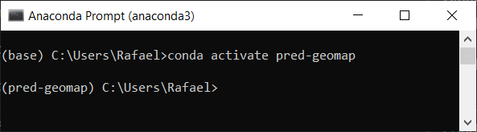
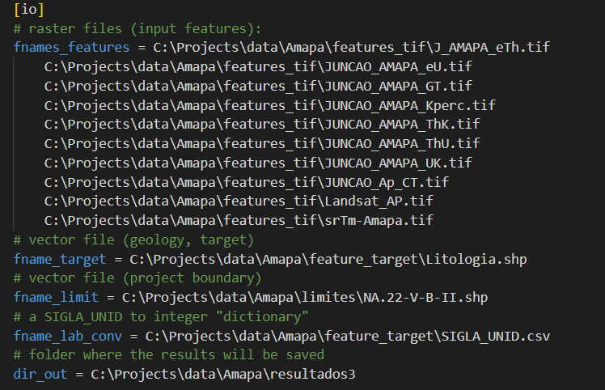
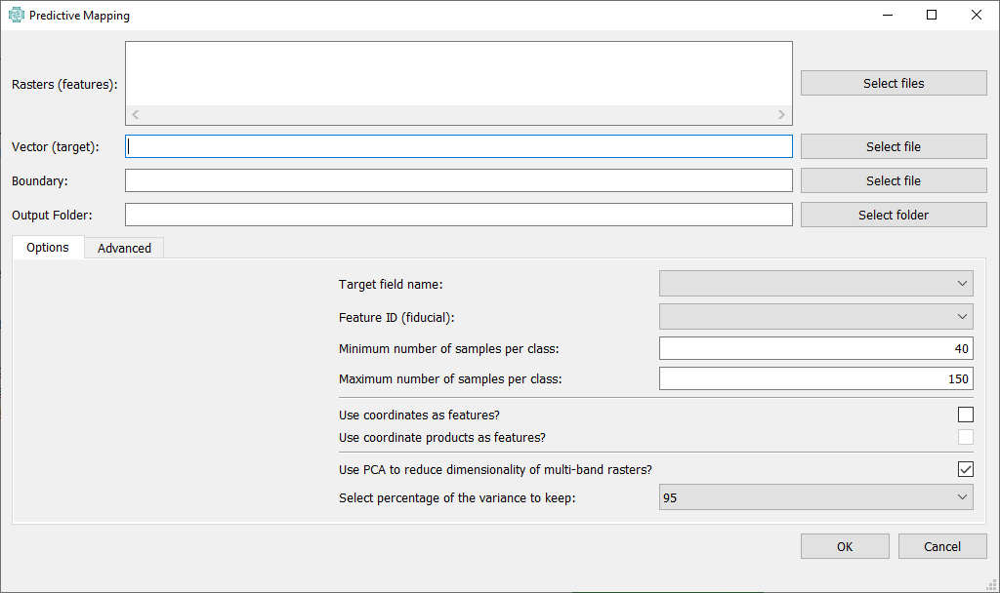

# predictive-geology-maps
Generate the predictive geology maps automatically to use in CPRM projects of anomaly charts. The methodology implemented here was used to generate predictive maps in [central Amapá](https://rigeo.cprm.gov.br/handle/doc/22542), [SW Pará](https://rigeo.cprm.gov.br/handle/doc/22541), and [N Rondônia](https://rigeo.cprm.gov.br/handle/doc/22531).

# Getting started
Clone this repository to your local machine using your tool of choice. Install [Anaconda](https://www.anaconda.com/) (if you don't have it) and open the [Anaconda Prompt](https://docs.anaconda.com/anaconda/user-guide/getting-started/). **Navigate to the location of the cloned repository** and install the [environment](environment.yml) using the command:  
`conda env create -f environment.yml`

Installing the `environment.yml` might take some time. 

Then, follow the instructions to activate the newly installed environment:  
`conda activate pred-geomap`

The terminal should look like this:  

Now you should be able to use the scripts. Don't forget to activate the `pred-geomap` environment whenever you want to run this code.  

# Running the scripts
The [main program](main.py) accepts a [configuration file](config.ini) as input and performs all the computations based on such file. The [configuration file](config.ini) looks like this:  

You can run the main program using the [Anaconda Prompt](https://docs.anaconda.com/anaconda/user-guide/getting-started/) after activating the `pred-geomap` environment. The program expects the [configuration file](config.ini) to be named [config.ini](config.ini) and be located in the same directory as the [main](main.py) file. Calling `python main.py` should be enough to execute the program if everything (the [main program](main.py) and the [configuration file](config.ini)) is in the same folder.  

We also included a very simple user interface that can help you set up the [configuration file](config.ini). You can call it through `python gui_main.py`:  

# Filenames
Currently the program is limited on filenaming structure. The target file should be a vector (e.g., shapefile) named `Litologia` with any extension (e.g., `Litologia.shp`). The rasters used for features should have the following substrings:
* GT
* CT
* Kperc
* eTh
* eU
* ThK
* ThU
* UK
* Landsat
* SRTM

These are not case sensitive. Meaning it should be ok if one of your inputs is a raster file named `my_area_kperc.tif` or `my_other_KPERC.tif`. Both would be interpreted as the raster containing K percentage. 

## Other Remarks
The Landsat file should have only five bands: 'B02', 'B03', 'B04', 'B06', 'B07'.

The `Litologia` file should have a field named `SIGLA_UNID` indentifying different litologies, and a field named `OBJECTID` that numerically identifies each of the polygons. 

One of the most notable drawbacks of the current methodology is the granular aspect of the results, which occurs due to the lack of spatial information from the input data for the models. Furthermore, training samples are randomly selected from the input data, making training, validation, and testing sets highly tainted with interpretation bias.

*******************************************************************************************************************  

*Software here is distributed on an "AS IS" BASIS, WITHOUT WARRANTIES OR CONDITIONS OF ANY KIND, either express or implied.*
